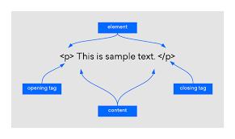

# HTML Elements  

An **HTML element** consists of a start tag, content, and an end tag, which together define its structure and functionality. Elements serve as the fundamental building blocks of a webpage and can represent various types of content, such as text, links, images, and headings.  

For example, the `<p>` element, used for paragraphs, includes an opening tag, content (text), and a closing tag.  

  

## Syntax  
```html
<tagname> Your Content... </tagname>
```  

## HTML Element Code Example  
In this example, `<p>` is the opening tag, `</p>` is the closing tag, and the text inside forms the content of the element.  

```html
<!-- HTML code to illustrate HTML elements -->
<!DOCTYPE html>
<html>

<head>
    <title>HTML Elements</title>
</head>

<body>
    <p>Welcome to CodebadgerTech!</p>
</body>

</html>
```  

# Table of Contents  

1. [**Key Points About HTML Elements**](#key-points-about-html-elements)  
2. [**Nested HTML Elements**](#nested-html-elements)  
3. [**Self-Closing (Empty) Elements**](#self-closing-empty-elements)  
4. [**Block-Level vs. Inline Elements**](#block-level-vs-inline-elements)  
5. [**Best Practices for Using HTML Elements**](#best-practices-for-using-html-elements)  

# Key Points About HTML Elements  

## 1. Syntax  

- An **opening tag** indicates where the content begins: `<tagname>`.  
- A **closing tag** indicates where the content ends: `</tagname>`.  
- The actual content resides between the opening and closing tags.  

## 2. Case Sensitivity  

- HTML tags are **not case-sensitive**. For example, `<B>` and `<b>` both represent bold text.  
- However, it’s a best practice to use **lowercase tags** for consistency and readability.  

# Nested HTML Elements  

Nested HTML elements occur when one element is placed inside another, creating a **hierarchical structure**. This structure is essential for organizing content on web pages, ensuring that elements relate logically and visually to each other.  

## Example  

In the following example, the `<html>` tag contains both the `<head>` and `<body>` tags, forming a nested structure:  

```html
<!DOCTYPE html>
<html>

<head>
    <title>HTML Elements</title>
</head>

<body style="text-align: center">
    <h1>CodebadgerTech</h1>
    <p>Computer programming</p>
</body>

</html>
```  

# Self-Closing (Empty) Elements  

HTML elements that **do not contain any content** and do not require a closing tag are called **empty elements**. These elements do not print anything directly but serve specific functional purposes.  

### Examples of Empty Elements:  
- `<br>` – Inserts a line break  
- `<hr>` – Creates a horizontal line  
- `<link>` – Links external resources  
- `<input>` – Defines input fields  

## Example  

In the following example, the `<br>` tag does not display any content but acts as a **line break** between the `<h2>` and `<p>` tags:  

```html
<!DOCTYPE html>
<html>

<head>
    <title>Empty HTML Elements</title>
</head>

<body>
    <h2>Welcome To CodebadgerTech</h2>
    <br />
    <p>Hello Folks.</p>

</body>

</html>
```  

# Block-Level vs. Inline Elements  

In HTML, elements are categorized into two main types based on their display behavior: **block-level elements** and **inline elements**.  

## 1. Block-Level Elements  

Block-level elements typically **start on a new line** and take up the **full width** available, regardless of their content width. They stack **vertically** and can contain other block-level elements as well as inline elements.  

### Examples of Block-Level Elements:  

- `<div>` – A general-purpose container for other elements.  
- `<p>` – Defines a paragraph.  
- `<h1>`, `<h2>`, …, `<h6>` – Heading elements of different levels.  
- `<ol>`, `<ul>` – Ordered and unordered lists.  
- `<table>` – Defines a table.  
- `<form>` – Used for HTML forms to collect user inputs.  
- **Semantic elements** that define areas of a webpage:  
  - `<section>`  
  - `<article>`  
  - `<nav>`  
  - `<aside>`  
  - `<header>`  
  - `<footer>`  

## 2. Inline Elements  

Inline elements **do not start on a new line**; instead, they appear on the **same line** as adjacent content, as long as there is space. They only take up as much width as their content requires. Inline elements are typically used within block-level elements to add content or style.  

### Examples of Inline Elements:  

- `<span>` – A general-purpose inline container for text and styling.  
- `<a>` – Creates hyperlinks.  
- `` – Embeds an image.  
- `<strong>`, `<b>` – Used for strong emphasis and bold text, respectively.  
- `<em>`, `<i>` – Used for emphasis and italic text, respectively.  
- `<br>` – Inserts a line break within text.  
- `<input>` – Creates interactive form controls.  

# Best Practices for Using HTML Elements  

## 1. Use Semantic HTML  
Use HTML elements according to their **intended purpose** to improve readability and SEO.  
- Use `<h1>`–`<h6>` for headings.  
- Use `<p>` for paragraphs.  
- Use `<a>` for links instead of `<span>` or `<div>`.  
- Use semantic elements like `<article>`, `<section>`, and `<nav>` for better document structure.  

## 2. Prioritize Accessibility  
Enhance accessibility by using the **right elements** and attributes:  
- Use `<main>`, `<aside>`, `<header>`, and `<footer>` for a well-structured layout.  
- Always include **alt text** for images (``) to assist visually impaired users.  
- Use proper **labeling** for form inputs (`<label for="id">`).  

## 3. Keep It Simple  
Avoid unnecessary complexity in your HTML structure:  
- Use **the simplest possible elements** to achieve the desired layout.  
- Avoid excessive `<div>` and `<span>` usage when a more **semantic** element is available.  
- Keep **clean, well-indented code** for better maintainability.  
```  