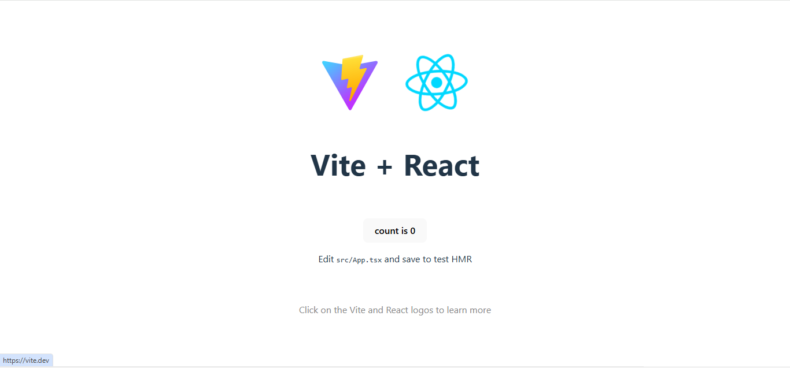

## 🧪 Tutorial 1: Starting a React + TypeScript Application

Welcome to your first step into **React** — one of the most important tools you'll learn in this course. Instead of just talking theory, let’s **dive right in** and build a simple application. Along the way, we’ll get familiar with the structure and core ideas behind React.

---

### 🚀 Step 1: Set up the Project

We'll use **Vite** to create and run our React app. Vite is a modern build tool that’s faster and simpler than older tools like Create React App.

We’ll call our first app **`introdemo`**.

#### Run the following commands in your terminal:

> 💡 Make sure you have **Node.js** installed.

```bash

npm create vite@latest introdemo

## you will see a couple of options to select from, 

1) select a framework
- move ur cursor using the arrow down button and select *React*

2) Select a variant:
 - select TypeScript


## next type the following command. this is to help you change directory to the project you just created and run installations to install react and other dependencies

cd introdemo
npm install
```

This sets up a new React project using **TypeScript**.

---

### 🟢 Step 2: Start the App

Now start the development server:

```bash
npm run dev
```

You should see something like this in the terminal:

```
  VITE v5.0  ready in 300ms

  ➜  Local:   http://localhost:5173/
```

Open that link in your browser, and you'll see the default Vite welcome screen. Vite usually runs on port `5173`, but it will automatically choose another one if that’s already taken.

### OutPut


---

### 🧭 Step 3: Explore the Project Structure

Open the project in your editor (we recommend **VS Code**). You’ll see a structure like this:

```
introdemo/
├─ index.html
├─ src/
│  ├─ App.tsx
│  ├─ main.tsx
│  ├─ assets/
│  ├─ App.css
│  └─ index.css
```
Note other stuffs are included too and it might not be in this order.

* The `src/` folder contains your application code.
* The entry point is `main.tsx`, where the root of your app is rendered.
* `App.tsx` is your first React component.

---

### ✂️ Step 4: Clean It Up

Let’s clean up the project so we start with a blank slate.

#### 1. Replace the contents of `main.tsx` with:

```tsx
import ReactDOM from 'react-dom/client';
import App from './App';

ReactDOM.createRoot(document.getElementById('root')!).render(<App />);
```

#### 2. Replace `App.tsx` with:

```tsx
const App = () => {
  return (
    <div>
      <p>Hello world</p>
    </div>
  );
};

export default App;
```

#### 3. Delete unused files:

You can safely delete the following to simplify your project:

* `App.css`
* `index.css`
* The entire `assets/` folder

---

### Now reload the web page


### 📖 What Just Happened?

* You created a **React app using TypeScript**.
* You saw how Vite runs a local development server.
* You simplified the code to focus on just the **core App component**.

---

### 🧠 Coming Up Next

Now that your app is running, we’ll dive into:

* What TSX actually is
* How components work
* And how to pass data between them
---
